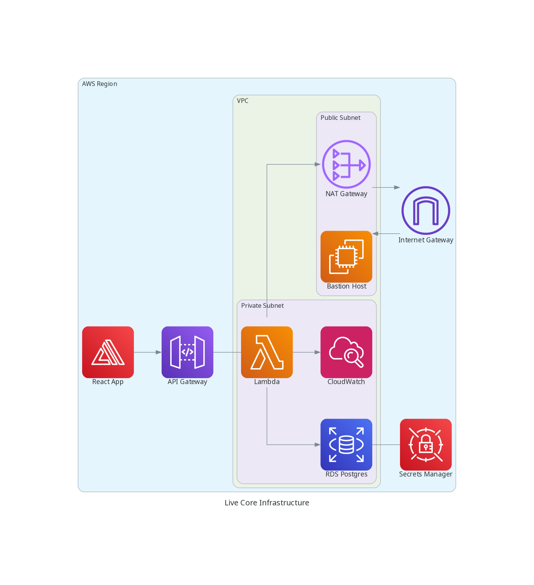

# Terraform AWS Starter Kit 🔥 🚀

Get started quickly with AWS infrastructure using a robust Terraform starter kit incorporating secure state management, VPC configuration, security groups, RDS provisioning, secrets management, SSM parameter store, and GitHub Actions integration!

<div align="center">

```ocaml
CLICK OR TAP ❲☰❳ TO SHOW TABLE-OF-CONTENTS :D
```

</div> <!-- center -->

## Motivation

The Terraform AWS Starter Boilerplate is designed to provide a simple and reliable starting point for creating a basic AWS infrastructure. It offers a ready-to-use root Terraform module that incorporates essential components and best practices to help you quickly set up a robust foundation for your applications.

<picture>
  <source media="(prefers-color-scheme: dark)" alt="" align="right" width="400px" srcset="./tools/dac/live_core_infrastructure.png"/>
  
</picture>

### Key Features

- **Secure State Management:** The boilerplate includes the necessary configurations to store the Terraform state in an S3 bucket, along with a DynamoDB table for state locking. This ensures that your infrastructure's state is secure and can be easily managed and shared among team members.

- **Scalable VPC Configuration:** The starter kit provisions a Virtual Private Cloud (VPC) with public and private subnets across three availability zones. This setup enables the segregation of application and database resources and provides high availability for your infrastructure components.

- **Enhanced Security:** The boilerplate implements security groups for the bastion host and database instances, ensuring controlled access to your resources. The bastion host allows secure access to private resources within the VPC, providing an additional layer of security.

- **Database Provisioning:** It includes the necessary configuration to provision an RDS PostgreSQL instance, as well as other database resources. This allows you to easily set up and manage your database infrastructure in a consistent and reproducible manner.

- **Secrets Management:** AWS Secrets Manager is integrated into the boilerplate to securely store and manage your database credentials. This ensures that sensitive information, such as usernames and passwords, is not exposed in your Terraform code or version control system.

- **Parameter Management:** The starter kit leverages AWS Systems Manager (SSM) Parameter Store to store and manage various parameters required for your infrastructure, such as VPC ID, subnet IDs, and other configuration details. This centralizes the management of configuration parameters, making it easier to update and maintain your infrastructure as it evolves.

- **GitHub Actions Integration:** The boilerplate comes with preconfigured GitHub Actions workflows that provide linting, security checks, and more. This integration enables automated checks and validation of your Terraform code, ensuring adherence to coding standards and identifying potential security vulnerabilities early in the development process.

  - Pull Request validation with [Danger](https://danger.systems/js).
  - Markdown linting.
  - Shell Scripting linting with [ShellCheck](https://www.shellcheck.net).
  - Terraform Format validation with [Terraform Fmt](https://www.terraform.io/docs/commands/fmt.html).
  - Terraform Security validation with [Terraform Security](https://github.com/aquasecurity/tfsec).
  - Terraform Docs update with [terraform-docs](https://terraform-docs.io/).
  - TODOs to GitHub Issues with [TODOs to Issues](https://github.com/alstr/todo-to-issue-action).

By using the Terraform AWS Starter Boilerplate, you can expedite the initial setup of your AWS infrastructure while incorporating proven best practices. It empowers you to focus on building and deploying your applications while providing a solid foundation for scalability, security, and maintainability.

We welcome contributions and feedback to improve this starter kit further, making it a valuable resource for the community.

## Quick Start

Go to the [`live/core`](./live/core) directory and follow the instructions in the
[README](./live/core/README.md).

There you will find the Terraform root module for our core infrastructure. This
is where we keep our Terraform variables and backend configuration.

We also have [Post deployment steps](./live/core/README.md#post-deployment-steps)
to help you test the setup and get familiar with the infrastructure.

## Live Infrastructure

We keep our live infrastructure in the `live` directory. This is where we keep
our Terraform variables, backend configuration, and our Terraform root modules.

| Module                                       | Description                                        |
| :------------------------------------------- | :------------------------------------------------- |
| [Core Infrastructure](./live/core/README.md) | Terraform root module for our core infrastructure. |

## Terraform Modules

We have custom Terraform modules that we use to bootstrap our infrastructure. We
keep them in the `modules` directory.

| Module                                             | Description                                                                 |
| :------------------------------------------------- | :-------------------------------------------------------------------------- |
| [VPC](./modules/vpc/README.md)                     | Terraform module to bootstrap a VPC for use with our shared infrastructure. |
| [RDS Postgres](./modules/rds-postgresql/README.md) | Terraform module to bootstrap a RDS Postgres instance.                      |
| [Bastion](./modules/bastion/README.md)             | Terraform module to bootstrap a bastion host.                               |

## Services

We may have some services that run to maintain our infrastructure. Here we have some ideas
you can have in there!

| Service                                                                                                                          | Description                                     |
| :------------------------------------------------------------------------------------------------------------------------------- | :---------------------------------------------- |
| [Start and Stop EC2 Instance](https://github.com/nanlabs/devops-reference/tree/main/examples/serverless-start-stop-ec2-instance) | Lambda function to start and stop EC2 instance. |

## Contributing

- Contributions make the open source community such an amazing place to learn, inspire, and create.
- Any contributions you make are **truly appreciated**.
- Check out our [contribution guidelines](./CONTRIBUTING.md) for more information.

## Contributors

<a href="https://github.com/nanlabs/terraform-aws-starter/contributors">
  
</a>

Made with [contributors-img](https://contrib.rocks).
