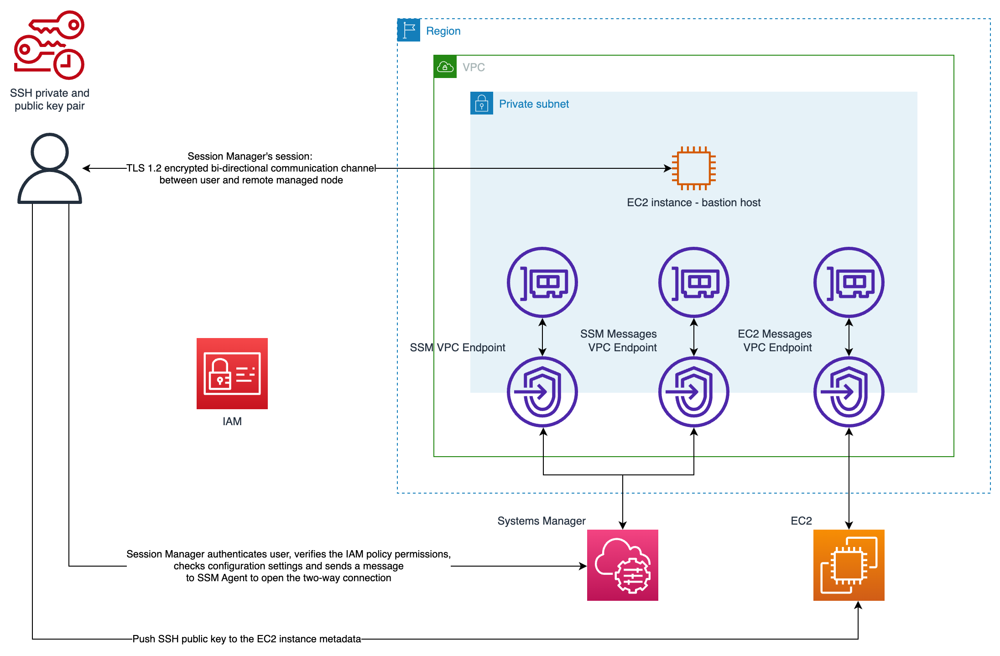

# Bastion Host Terraform Module

Terraform module to bootstrap a bastion host in AWS using EC2.

## Summary

A bastion host, sometimes called a `jump box`, is a server that provides a single point of access from an external network to resources located in a private network. This module uses AWS Systems Manager Session Manager and Amazon EC2 Instance Connect to securely connect to an Amazon EC2 bastion host without exposing any inbound ports or managing long-lived SSH keys.

## Usage

```hcl
module "bastion" {
  source                       = "../../modules/bastion"

  name                         = "example-bastion"
  vpc_id                       = "vpc-1234567890"
  subnets                      = ["subnet-1234567890", "subnet-0987654321"]
}
```

## Architecture

### Target technology stack

- VPC with at least one private subnet
- 3 VPC (Interface) Endpoints with corresponding security groups and security group rules
- EC2 instance (t3.nano) with Ubuntu 24.04 installed with associated:
  - IAM role
  - IAM instance profile
  - security group

### Target architecture



We deploy single isolated EC2 instance (t3.nano) with Ubuntu 24.04 installed inside of the private subnet in created
VPC. Instance does not expose any ports and does not have public IP assigned. It is fully isolated from the Internet and
uses VPC (Interface) Endpoints to communicate with AWS services (Systems Manager and EC2). You are going to assume an
IAM role with associated IAM policies that grant you required privileges to authenticate, authorize and connect to EC2
instance.
Following [the least privilege principle](https://docs.aws.amazon.com/IAM/latest/UserGuide/best-practices.html#grant-least-privilege),
created EC2 instance does not have access to other resources in your AWS account. You have to explicitly grant it by
assigning IAM policies to IAM role used by EC2 instance.

### Automation and scale

This pattern can be adopted to be a part of a larger infrastructure code and deployed in an automated way using CI/CD
tools. You can modify the code to change the type of deployed EC2 instance to adjust its parameters to your specific
needs.

### EC2 Instance Provisioning

The created EC2 instance is provisioned using [cloud-init](https://cloudinit.readthedocs.io/en/latest/). You can
customize the instance provisioning by modifying the content of the `cloud_init` template file at `templates/cloud_init.tpl`.

## Connecting to the Bastion Host Using Session Manager

### Prerequisites

Ensure the following prerequisites are met:

1. **AWS Command Line Interface v2**: Ensure the AWS CLI is installed on your local machine. Check the [AWS CLI Installation Guide](https://docs.aws.amazon.com/cli/latest/userguide/install-cliv2.html) for more information.
2. **Session Manager Plugin**: Ensure the Session Manager Plugin is installed on your local machine. Check the [AWS Session Manager Plugin Installation Guide](https://docs.aws.amazon.com/systems-manager/latest/userguide/session-manager-working-with-install-plugin.html) for more information.

### Setup Local Environment

1. **Install tools**

   Follow [Prerequisites](#prerequisites) section to install AWS CLI and Session Manager plugin.

2. **Configure SSH connection**

   Follow [the documentation](https://docs.aws.amazon.com/systems-manager/latest/userguide/session-manager-getting-started-enable-ssh-connections.html#ssh-connections-enable) to update the SSH configuration file to allow SSH connections through Session Manager. It allows running a proxy command that starts a Session Manager session and transfer all data through opened connection.

3. **Generate SSH keys**

   Generate local SSH private and public keys. For example, you can use following command:

   ```shell
   ssh-keygen -t rsa -f my_key
   ```

   It will generate private and public SSH key pair which are going to be used to connect to bastion host.
   It is recommended to provide password to protect access to keys and store keys in secure location.

### Connect to Bastion Host

1. **Assume IAM Role**

   Assume an IAM role that has permissions to authenticate, authorize, and connect to the EC2 instance.

2. **Get instance id**

   In order to connect to deployed bastion host you will need to obtain EC2 instance id. There are multiple ways you can do
   that. For example you can get it using AWS console by navigating
   to [EC2 dashboard](https://eu-central-1.console.aws.amazon.com/ec2/home) or through AWS CLI using:

   ```shell
   aws ec2 describe-instances
   ```

   To further filter results you can use following command:

   ```shell
   aws ec2 describe-instances --filters 'Name=tag:Name,Values=$BASTION_HOST_TAG'  --output text --query 'Reservations[*].Instances[*].InstanceId' --output text
   ```

   Replace `$BASTION_HOST_TAG` with tag used to mark bastion host.
   Copy obtained EC2 instance id for later use.

3. **Send SSH keys**

   In order to connect to the bastion host we first have to send SSH key to the host using EC2 Instance Connect.
   Use following command replacing `$INSTANCE_ID` with EC2 instance id obtained in previous step and `$PUBLIC_KEY_FILE`
   with path to your public key file (for example: `my_key.pub`).

   **Be sure to use public key and NOT private key.**

   ```shell
   aws ec2-instance-connect send-ssh-public-key --instance-id $INSTANCE_ID --instance-os-user ubuntu --ssh-public-key file://$PUBLIC_KEY_FILE
   ```

   You should receive message indicated successful upload of key. You have just uploaded temporary SSH key
   to [EC2 instance metadata](https://docs.aws.amazon.com/AWSEC2/latest/UserGuide/ec2-instance-metadata.html) where it’s
   going to remain for 60 seconds. After 60 seconds SSH key gets removed automatically, and you won’t be able to use it to
   connect to the instance. You will see “Permission denied” error if you try. If this happens you can resend the key using
   the same command.

   This means that you have 60 seconds to initialize SSH connection after you upload keys. Follow next step to do so.

4. **Connect using SSH through Sessions Manager**

   In this last step you will connect to your bastion host using SSH. Use following command replacing
   `$PRIVATE_KEY_FILE` with path to your private key (for example: my_key) and `$INSTANCE_ID` with EC2 instance id obtained
   in previous steps.

   ```shell
   ssh -i $PRIVATE_KEY_FILE ubuntu@$INSTANCE_ID
   ```

   Confirm connection by typing yes. It will open SSH connection using previously configured Session Manager.

You’re in!

### Additional Useful Commands

#### List Active Sessions

To list all active sessions:

```bash
aws ssm describe-sessions --state "Active"
```

#### Terminate a Session

To terminate a specific session, you need the session ID. First, list the active sessions to get the session ID:

```bash
aws ssm describe-sessions --state "Active"
```

Then terminate the session using the session ID:

```bash
aws ssm terminate-session --session-id <session-id>
```

### Example Script for Complete Workflow

Here's a complete example script to retrieve the Bastion instance ID, push the SSH public key, and start a Session Manager session:

```bash
# Asume an IAM Role
assume_role_output=$(aws sts assume-role --role-arn arn:aws:iam::<account-id>:role/<role-name> --role-session-name AWSCLI-Session)

# Export credentials
export AWS_ACCESS_KEY_ID=$(jq -r '.Credentials.AccessKeyId' <<< "$assume_role_output")
export AWS_SECRET_ACCESS_KEY=$(jq -r '.Credentials.SecretAccessKey' <<< "$assume_role_output")
export AWS_SESSION_TOKEN=$(jq -r '.Credentials.SessionToken' <<< "$assume_role_output")

# Retrieve Bastion instance ID
bastion_instance_id=$(aws ec2 describe-instances --filters "Name=tag:Name,Values=<BASTION_HOST_TAG>" --query "Reservations[*].Instances[*].InstanceId" --output text)
echo "Bastion Instance ID: $bastion_instance_id"

# Push SSH Public Key
ssh_public_key="your-public-key"
aws ec2-instance-connect send-ssh-public-key --instance-id "$bastion_instance_id" --instance-os-user ubuntu --ssh-public-key file://$ssh_public_key

# Start Session Manager session with Bastion Host
aws ssm start-session --target "$bastion_instance_id"

# Connect using SSH through Session Manager
ssh -i /path/to/your/private/key ubuntu@$bastion_instance_id
```

### Optional Steps

The following steps are optional and can be used to further secure the Bastion host
or to streamline the connection process.

#### Quick Connection Using Script

To streamline the process of connecting to the Bastion host, you can use the provided `connect.sh` script. This script automates the steps of generating an SSH key, uploading it to the instance, and establishing a connection through AWS Systems Manager.

```sh
./scripts/connect.sh -i <instance-id>
```

Replace `<instance-id>` with the ID of the Bastion host instance. The script will generate an SSH key pair, upload the public key to the Bastion host, and establish an SSH connection using the private key.

Use the `-h` or `--help` flag to see the available options:

```sh
$ ./scripts/connect.sh --help

Script to connect to an AWS Bastion host. Usage:

    connect.sh [option] ARGUMENTS...

Options:
    -h, --help                      Display this help message

        --instance-id=INSTANCE_ID   EC2 instance ID of the Bastion host
        --tag=TAG                   Tag to identify the Bastion host.
                                    Will be used to retrieve the instance ID.
                                    If not provided, instance ID must be provided.
                                    Will be ignored if instance ID is provided.

        --key-name=KEY_NAME         Name of the SSH key file (default: bastion_key)
        --key-dir=KEY_DIR           Directory to store the SSH key (default: ~/.ssh)
```

#### Use Other SSH Options to Open Connection

It is possible to use different options to open connection to bastion host. For example you can use -D 8888 option to open SSH connection with a local “dynamic” application-level port forwarding through 8888 port. See [this link](https://explainshell.com/explain?cmd=ssh+-i+%24PRIVATE_KEY_FILE+-D+8888+ubuntu%40%24INSTANCE_ID) for detailed explanation.

```shell
ssh -i $PRIVATE_KEY_FILE -D 8888 ubuntu@$INSTANCE_ID
```

This kind of connection opens a SOCKS proxy you can use for example to forward traffic from your local browser through bastion host. Refer to man pages of ssh command to see all options.

### Troubleshooting

Sometimes you might experience `TargetNotConnected` error when trying to connect to the bastion host.

Solution:

1. Follow [Reboot your instance](https://docs.aws.amazon.com/AWSEC2/latest/UserGuide/ec2-instance-reboot.html) AWS documentation to reboot deployed bastion host.
2. Follow [Connect to the bastion host](#connect-to-bastion-host) section of this document and try to connect again.

## Additional Resources

- [AWS Systems Manager Session Manager](https://docs.aws.amazon.com/systems-manager/latest/userguide/session-manager.html)
- [Amazon EC2 Instance Connect](https://docs.aws.amazon.com/AWSEC2/latest/UserGuide/Connect-using-EC2-Instance-Connect.html)
- [Enabling SSH connections through Session Manager](https://docs.aws.amazon.com/systems-manager/latest/userguide/session-manager-getting-started-enable-ssh-connections.html#ssh-connections-enable)

## Module Documentation

The module documentation is generated with [terraform-docs](https://github.com/terraform-docs/terraform-docs) by running `terraform-docs md . > ./docs/MODULE.md` from the module directory.

You can also view the latest version of the module documentation [here](./docs/MODULE.md).
